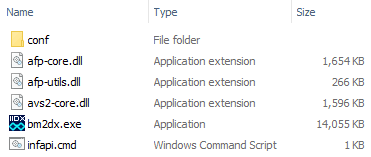

## infapi

A basic REST API for encoding & decoding beatmania IIDX INFINITAS requests and responses.

This project is an example of the code from
my **[blog posts on Eacnet request signing](https://aixxe.net/series/eacnet-request-signing)**.

### Requirements

infapi requires a local installation
of **[beatmania IIDX INFINITAS](https://p.eagate.573.jp/game/infinitas/2/download/index.html)** to launch.

You **do not** need an active subscription to use infapi.

<sub>※ A KONAMI ID is required to access the game client download page.</sub>

### Usage

- Copy `infapi.dll` and `infapi.exe` to the `game/app` directory.
- Run `infapi.exe` to start the server.

The server binds to all available interfaces and listens on port 8080.

Refer to the `examples/curl` directory for sample requests.

### Building with Docker

To build the Docker image, you will need to copy several files from an existing game installation:

- Copy all files from the `game/app` directory to the `assets/docker` directory.
- Copy the `game/conf` directory to the `assets/docker` directory.

Once complete, the `assets/docker` directory should contain the following files:



You can now build and use infapi with Docker:

```bash
docker build --build-arg BUILD_TYPE=Release -t aixxe/infapi .
docker run --rm -p 8080:8080 aixxe/infapi
```